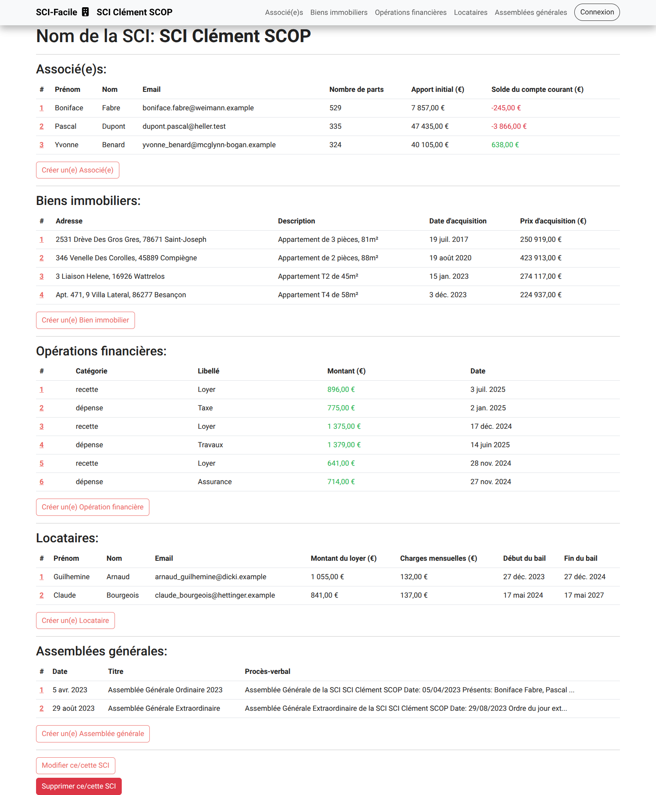

[Voir la vidéo du test](public/demo-sci-facile.webm)
___


ChatGPT chat : https://chatgpt.com/share/688c5277-82c4-8007-91d8-5d9a562e4a49

> Je veux créer un app rails de gestion de SCI, décrit un premier document 

Voici un exemple de **premier document de cadrage** pour ton application Rails de gestion de SCI (Société Civile Immobilière). Ce genre de document t'aidera à clarifier le périmètre, la cible, les fonctionnalités et la vision du projet avant d'attaquer le développement.

---

# 📄 Document de Cadrage

## Projet : Application de Gestion de SCI

---

## 🎯 Objectif du projet

Développer une application web permettant de gérer facilement une SCI :

* Suivi de la comptabilité simple (recettes/dépenses)
* Suivi des associés (capital, répartition, mouvements)
* Génération des documents comptables (tableau de répartition, relevé des comptes courants)
* Gestion des assemblées générales et PV
* Gestion locative basique : loyers, charges, locataires

---

## 👥 Utilisateurs cibles

* Gérants de SCI à usage familial ou patrimonial
* Comptables / experts-comptables mandatés
* Associés souhaitant suivre la vie de la société

---

## 🧩 Fonctionnalités principales

### 1️⃣ Gestion des associés

* Fiche associée (nom, coordonnées, parts détenues, capital apporté)
* Historique des mouvements de parts (cession, augmentation, réduction)
* Calcul automatique des répartitions (dividendes, quote-part des charges)

### 2️⃣ Gestion financière

* Enregistrement des recettes (loyers, remboursements, etc.)
* Enregistrement des dépenses (charges, travaux, impôts, etc.)
* Comptes courants d’associés (avances, retraits)
* Visualisation simplifiée des bilans par exercice

### 3️⃣ Gestion locative simplifiée

* Fiches biens immobiliers
* Fiches locataires
* Loyer perçu / charges refacturées
* Échéancier des paiements

### 4️⃣ Assemblées Générales

* Création de convocations / ordres du jour
* Modèle de PV automatisé
* Suivi des décisions

---

## 📊 Tableau de bord

* Vue d'ensemble de la SCI (trésorerie, dettes, recettes à venir)
* Récapitulatif des comptes associés
* Alertes importantes (loyers en retard, échéances fiscales)

---

## 📂 Documents générés

* États financiers simplifiés
* Tableaux de répartition des résultats
* Modèles de convocations / PV d'AG
* État des comptes courants des associés

---

## 🛠️ Stack technique proposée

* Ruby on Rails (dernière version stable)
* PostgreSQL
* Turbo / Stimulus pour l’interactivité
* Bootstrap ou TailwindCSS pour l’interface
* PDFKit ou Prawn pour la génération de PDF

---

## 🔓 Accès / Sécurité

* Gestion des comptes utilisateurs (gérants / associés / experts-comptables)
* Authentification (Devise)
* Rôles et permissions (Pundit ou autre)

---

## 🗓️ Premières étapes du projet

1. Création du schéma de données (SCI, associés, biens, opérations, AG, etc.)
2. Mise en place d'un MVP :

   * CRUD associés / opérations / biens
   * Suivi basique des flux financiers
   * Génération d'un premier tableau de répartition simplifié
3. Ajout progressif des fonctionnalités secondaires (AG, locataires, documents PDF, etc.)

---

Si tu veux, je peux t’aider à détailler :

* Le **schéma de la base de données**
* Un **User Story Mapping**
* Une **roadmap MVP**
* Ou carrément te générer le premier scaffold Rails (avec les modèles, contrôleurs et routes).

Dis-moi comment tu veux poursuivre.


> je veux tout, réponds moi en français , mais défini tout en anglais

Très bien. Voici une réponse structurée en **français** mais avec toutes les **définitions en anglais** comme tu le souhaites.

---

## 🔶 **Schéma de base de données (Database Schema)**

```plaintext
Table: companies
- id
- name
- created_at
- updated_at

Table: associates
- id
- company_id (references companies)
- first_name
- last_name
- email
- shares_count (number of shares held)
- initial_contribution (in euros)
- current_account_balance (in euros)
- created_at
- updated_at

Table: properties
- id
- company_id (references companies)
- address
- description
- acquisition_date
- acquisition_price
- created_at
- updated_at

Table: tenants
- id
- property_id (references properties)
- first_name
- last_name
- email
- rent_amount (monthly)
- charges_amount (monthly)
- lease_start_date
- lease_end_date
- created_at
- updated_at

Table: financial_operations
- id
- company_id (references companies)
- property_id (nullable)
- tenant_id (nullable)
- associate_id (nullable)
- category (enum: income, expense, current_account)
- label
- amount (positive or negative depending on category)
- date
- created_at
- updated_at

Table: general_meetings
- id
- company_id (references companies)
- date
- title
- minutes_text (AG minutes)
- created_at
- updated_at
```

---

## 🔶 **User Story Mapping (USM)**

### **Backbone (Principal Activities)**

* Manage Associates
* Manage Properties
* Manage Financial Operations
* Manage Tenants
* Manage General Meetings
* View Financial Summary

---

### **User Stories (Detailed Tasks)**

#### 🧑‍🤝‍🧑 **Manage Associates**

* As a manager, I can create, update, and delete associates.
* As a manager, I can track shares distribution.
* As a manager, I can track associate current accounts.

#### 🏠 **Manage Properties**

* As a manager, I can create, update, and delete properties.
* As a manager, I can link properties to tenants.
* As a manager, I can track acquisition costs.

#### 💶 **Manage Financial Operations**

* As a manager, I can log incomes (rents, reimbursements, etc.).
* As a manager, I can log expenses (charges, taxes, repairs, etc.).
* As a manager, I can register movements on current accounts.
* As a manager, I can generate reports per year.

#### 👨‍💼 **Manage Tenants**

* As a manager, I can add tenants.
* As a manager, I can assign rents and charges to tenants.
* As a manager, I can follow payment status.

#### 📄 **Manage General Meetings**

* As a manager, I can create meeting agendas.
* As a manager, I can generate minutes (PDF).
* As a manager, I can follow decisions history.

#### 📊 **View Financial Summary**

* As an associate, I can view my current account balance.
* As a manager, I can view a global financial summary (cash, debts, etc.).
* As a manager, I can export documents (PDF/CSV).

---

## 🔶 **Roadmap MVP (Minimum Viable Product)**

### **Phase 1 — Basic Core (CRUD)**

* CRUD for associates
* CRUD for properties
* CRUD for financial operations
* CRUD for tenants
* Financial dashboard (basic)

### **Phase 2 — Features for Real Usage**

* Associate shares calculation
* Current account management (automatic sums)
* Income/expense breakdown per property
* Tenant rent tracking
* PDF generation for AG minutes

### **Phase 3 — Polish and Prepare Production**

* Authentication (Devise)
* Authorization (Pundit)
* Document export (Prawn / PDFKit)
* Accounting export (CSV)
* Styling (Tailwind / Bootstrap)

---

## 🔶 **Premiers Scaffold Rails**

Voici la liste des scaffolds que je te recommande de créer avec `rails generate scaffold` :

```bash
rails g scaffold Company name:string
rails g scaffold Associate company:references first_name:string last_name:string email:string shares_count:integer initial_contribution:decimal current_account_balance:decimal
rails g scaffold Property company:references address:string description:text acquisition_date:date acquisition_price:decimal
rails g scaffold Tenant property:references first_name:string last_name:string email:string rent_amount:decimal charges_amount:decimal lease_start_date:date lease_end_date:date
rails g scaffold FinancialOperation company:references property:references tenant:references associate:references category:string label:string amount:decimal date:date
rails g scaffold GeneralMeeting company:references date:date title:string minutes_text:text
```

---

Si tu veux, je peux ensuite te fournir le :
✅ Fichier `routes.rb`
✅ Exemple de modèle relationnel en Rails (`has_many`, `belongs_to`)
✅ Wireframes (schémas d'interface) pour le back-office

Dis-moi ce que tu veux en priorité.

> oui et dit moi ce que sont des minutes dans As a manager, I can generate minutes (PDF).

Très bonne question.
Dans le contexte d'une **SCI** ou d'une **entreprise**, le mot anglais **"minutes"** signifie simplement :

➡️ **Procès-verbal (PV) d'Assemblée Générale (AG)**

---

### 📄 **Définition en anglais :**

> **Meeting Minutes** are the official written record of everything that was said, decided, or voted during a meeting. They summarize decisions, actions, and responsibilities.

---

### 📄 **En français (SCI) :**

> Le **procès-verbal d'Assemblée Générale** est un document qui consigne de façon officielle :
>
> * les décisions prises,
> * les votes réalisés,
> * les participants présents ou représentés,
> * et éventuellement les débats importants.

---

### ✅ Exemples concrets de ce qu’on retrouvera dans ces **minutes / procès-verbaux** :

* Approbation des comptes annuels
* Répartition des bénéfices (dividendes ou report à nouveau)
* Décision de travaux importants
* Changement de gérant
* Augmentation de capital

---

### 📂 Pourquoi générer un PDF dans ton app ?

Parce que chaque année (ou chaque décision importante), une SCI doit conserver ces **procès-verbaux signés** et souvent les transmettre au comptable ou au notaire.
Ton application Rails pourra générer automatiquement un **PDF clair et formel** à partir des informations saisies.

---

Si tu veux, je peux te faire un **exemple de modèle de procès-verbal** en anglais et en français. Tu veux ?


---
---

# Liens utiles

- https://fr.wikipedia.org/wiki/Soci%C3%A9t%C3%A9_civile_immobili%C3%A8re
- https://www.economie.gouv.fr/particuliers/gerer-mon-argent/gerer-mon-budget-et-mon-epargne/societe-civile-immobiliere-comment-ca

---
---

Excellente question ! Voici les différences entre ces 4 catégories d'opérations financières dans une SCI :

## **RECETTE** 💰
- **Définition** : Argent qui ENTRE dans la SCI en échange d'un service/bien
- **Exemples** : Loyers, revenus locatifs
- **Impact** : Augmente les fonds de la SCI
- **Dans vos données** : Les loyers de Philothée (663€, 1397€, 1478€)

## **DÉPENSE** 💸
- **Définition** : Argent qui SORT de la SCI pour faire fonctionner l'activité
- **Exemples** : Charges, assurance, taxes, travaux, entretien
- **Impact** : Diminue les fonds de la SCI
- **Dans vos données** : Charges (514€), Assurance (446€), Taxe (435€), Travaux (2982€)

## **APPORT** 📥
- **Définition** : Argent apporté par les ASSOCIÉS à la SCI (pas un revenu d'activité)
- **Types** : 
  - Apport initial (capital)
  - Apport en compte courant (prêt des associés à la SCI)
- **Impact** : Augmente les fonds de la SCI + crée une dette envers l'associé
- **Dans vos données** : Herluin a apporté 7125€ en compte courant

## **REMBOURSEMENT** 📤
- **Définition** : La SCI rembourse de l'argent aux associés (leurs comptes courants)
- **Nature** : Pas une dépense d'activité, mais un remboursement de dette
- **Impact** : Diminue les fonds de la SCI + diminue la dette envers l'associé
- **Dans vos données** : Remboursement à Aurélie (3667€) et opération remboursement (1936€)

## **Résumé pratique :**
- **Recettes** = La SCI gagne de l'argent par son activité
- **Dépenses** = La SCI dépense pour son activité  
- **Apports** = Les associés prêtent à la SCI
- **Remboursements** = La SCI rembourse ses associés

**Impact sur le bilan :** Recettes et apports augmentent la trésorerie, dépenses et remboursements la diminuent, mais seules les recettes et dépenses affectent le résultat de la SCI !


# README

This README would normally document whatever steps are necessary to get the
application up and running.

Things you may want to cover:

* Ruby version

* System dependencies

* Configuration

* Database creation

* Database initialization

* How to run the test suite

* Services (job queues, cache servers, search engines, etc.)

* Deployment instructions

* ...
